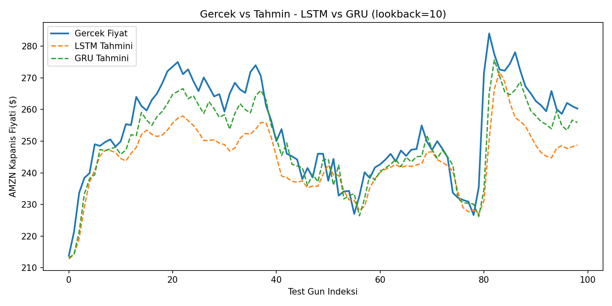

# Stock Price Prediction: LSTM vs GRU

PyTorch ile zaman serisi regresyonu — AMZN hisse senedinin günlük kapanış
fiyatını, geçmiş bir pencereden yola çıkarak tahmin eden iki farklı sıralı
veri mimarisinin (LSTM ve GRU) uygulanması ve karşılaştırılması.

## Amaç

Bu proje, temel bir makine öğrenmesi kavramından (regresyon) başlayıp
PyTorch'ta LSTM ve GRU modellerini sıfırdan kurmayı, sistematik bir
deney süreciyle (Ar-Ge) hiperparametre kararları vermeyi ve iki mimariyi
adil koşullarda karşılaştırmayı amaçlıyor.

## Veri Seti

- Kaynak: [yfinance](https://github.com/ranaroussi/yfinance) (canlı API, ücretsiz)
- Hisse: AMZN (Amazon)
- Aralık: Son 2 yıl, günlük kapanış (Close) fiyatı
- Kaydedilmiş dosya: `data/amzn_prices.csv` (reproducibility için canlı çekimden sonra kaydedildi)

## Kurulum

```bash
python3 -m venv .venv
source .venv/bin/activate
pip install -r requirements.txt
```

## Kullanım

```bash
python3 src/data_prep.py     # veri hazırlığını test et (normalize + sliding window)
python3 src/models.py        # model mimarilerini test et
python3 src/train.py         # tek seferlik egitim (baseline)
python3 src/experiments.py   # lookback deney matrisi (10/20/30 x LSTM/GRU)
python3 src/evaluate.py      # final degerlendirme + grafik
```

## Mimari

| Parametre       | Değer |
|-----------------|-------|
| Lookback penceresi | 20 (baseline) / **10 (final)** |
| Hidden size     | 32 |
| Katman sayısı   | 2 |
| Loss / Optimizer | MSELoss / Adam |
| Epoch           | 100 |

Kararların gerekçesi için: [`docs/approach.md`](docs/approach.md)

## Sonuçlar

Final karşılaştırma (lookback=10, test seti üzerinde):

| Model | Test RMSE ($) | Eğitim Süresi (s) |
|-------|---------------|--------------------|
| LSTM  | 11.94         | 0.49               |
| GRU   | **7.35**      | **0.38**           |

**GRU, LSTM'e göre hem daha isabetli hem daha hızlı** — referans makaledeki
bulguyla tutarlı. Gerçek vs tahmin grafiği:



Tam deney matrisi (6 kombinasyon, dropout testi dahil): [`docs/experiment_results.csv`](docs/experiment_results.csv)

## İş Akışı

Proje 10 aşamalı, Ar-Ge sprintleri içeren bir yol haritasıyla geliştirildi
(kurulum → kavramsal temel → literatür araştırması → PyTorch → veri
pipeline → model → eğitim/deney → değerlendirme → dokümantasyon → kritik
değerlendirme). Her aşama ayrı bir Git commit/branch olarak izlenebilir.

## Kaynaklar

**Resmi dokümantasyon:**
- [PyTorch Docs](https://docs.pytorch.org)
- [yfinance Docs](https://ranaroussi.github.io/yfinance/)

**Akademik referanslar:**
- Hochreiter, S., & Schmidhuber, J. (1997). *Long Short-Term Memory*. Neural Computation, 9(8), 1735–1780.
- Cho, K., et al. (2014). *Learning Phrase Representations using RNN Encoder–Decoder for Statistical Machine Translation*. EMNLP.
- *Hyperparameter-Optimized RNN, LSTM, and GRU Models for Stock Price Prediction*. MDPI Symmetry (2025).

**Uygulama referansı:** Rodolfo Saldanha, [Stock Price Prediction with PyTorch](https://medium.com/swlh/stock-price-prediction-with-pytorch-37f52ae84632) (Medium).

## Sınırlılıklar

Hisse senedi fiyat tahmini gerçek dünyada güvenilir bir problem değildir;
bu proje tek hisse/tek özellik (Close fiyatı) ile eğitim amaçlı bir
uygulamadır, bir yatırım aracı değildir. Detaylı kritik değerlendirme
için `docs/approach.md`'ye bakınız.
